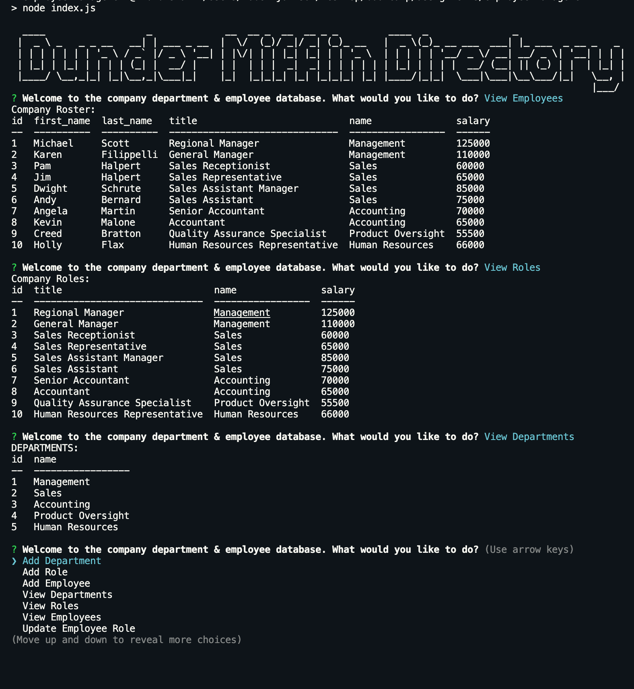

# employee-management
assignment 12

  [](https://github.com/johnsonr84)
  [](https://github.com/johnsonr84/employee-management)
  [](https://github.com/johnsonr84/employee-management)
  [](https://choosealicense.com/licenses/mit/)

  ## Table of Contents 
  * [Description](#Description)
  * [User Story](#UserStory)
  * [Project URL](#Project-URL)
  * [Deplyment](#Deployment)
  * [Mock-up](#Mock-up)
  * [Usage](#Usage)
  * [Credits](#Credits)
  * [License](#License)
  * [Features](#Features)
  * [Tests](#Tests)
  * [Resources](#Resources)
  * [Contact](#Contact)
  * [Designed and built by](#Designed-and-built-by)
  #
  
  ## Description 
  Architect and built a Content Management System (CMS) to manage a company's employees using node, inquirer and MySQL.

  ## UserStory 
  ```
  As a business owner
  I want to be able to view and manage the departments, roles, and employees in my company
  So that I can organize and plan my business
  ```

  ## Project URL
  https://github.com/johnsonr84/employee-management

  ## Deployment
  N/A

  ## Mock-Up
  <table>
  <tr>
    <td>employee-management</td>
  </tr>
  <tr>
    <td></td>
  </tr>
  </table>

  ## Installation 
  Steps needed to install and run the application:

  Run npm install to install dependencies. run schema.sql in MYSQLWorkBench Make sure to update your connection information.

  ## Usage 
  Run node index.js to start the application. Use your keyboard to select the various options.

  ## Credits 
  Me, myself and Irene 

  ## License 
  This project is [mit](https://choosealicense.com/licenses/mit/) licensed.

  ## Features
  Coming soon maybe 

  ## Tests
  No tests required at this time 

  ## Resources
  * [Choose a License](https://choosealicense.com/)
  * [Badmath](https://img.shields.io/github/languages/top/nielsenjared/badmath)
  * [shields.io](https://shields.io/)
  * [w3schools](https://www.w3schools.com/)
  * [stackoverflow.com](https://stackoverflow.com/)
  * [YouTube](https://www.youtube.com/)
  * [UOFU-SAN-FSF-PT-11-2020-U-C/12-MySQL/Activities]
  * [SQL Bolt](https://sqlbolt.com/)
  * [MySQL](https://www.npmjs.com/package/mysql)
  * [InquirerJs](https://www.npmjs.com/package/inquirer/v/0.2.3)
  * [console.table](https://www.npmjs.com/package/console.table)

  ## Contact
  Email: robertcjohnson1984@gmail.com 

  ## Designed and built by
  Author(s): Rob Johnson  
